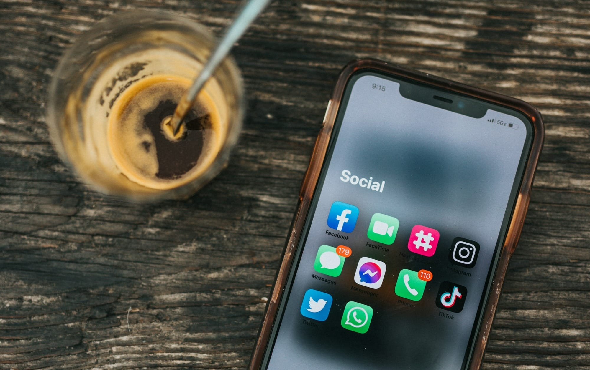
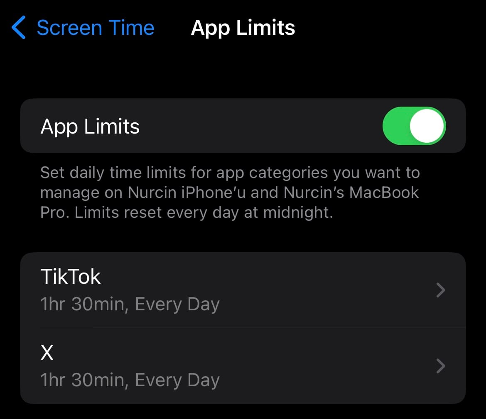
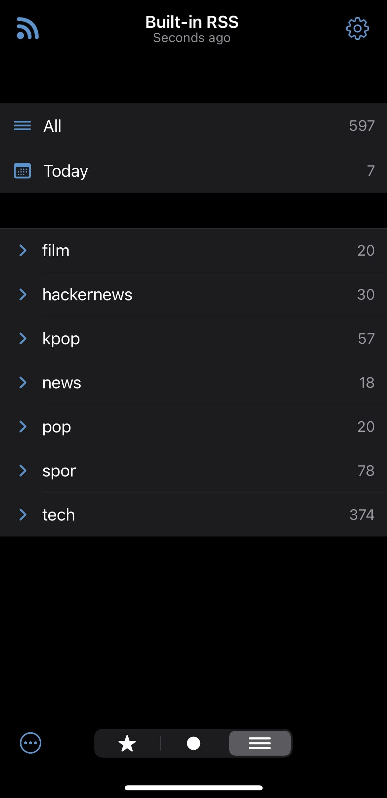

I've been struggling with something for a long time, and that's trying to use social media less. Especially by spending too much time on Twitter and TikTok during my free hours after work. I want to start by talking about ways I tried, even if they didn't work well:

### 1. Deleting Apps from my Phone

I know we all try this first. It might work for a bit, especially in the beginning, but let's be honest, after a while, we end up going to social media through the web browser. So, this didn't really help me.

### 2. Closing Social Media Accounts

I think completely getting rid of something to use it less doesn't really work. In fact, we end up being even more curious about it because we got rid of it (check out [FOMO](https://en.wikipedia.org/wiki/Fear_of_missing_out)).

So, how did I manage to use social media less? First off, I already saw Instagram as something I didn't need for the past year. I didn't feel like I was missing out on much without it. My biggest problem was not being able to cut down on Twitter and TikTok. Here's what I did:

### 1. Setting Time Limits for Apps

With the new feature in iOS 16, I could set daily time limits for apps, and it really helped me. Instead of completely getting rid of something, it's better to cut down because you can still catch up on things you missed during a set time at the end of the day. I set separate 1.5-hour limits for Twitter and TikTok, and it worked.

### 2. Using a RSS Reader App

What made me use Twitter a lot was the fear of missing out on something important. To address this, I added the RSS links of accounts I liked to a RSS Reader app. I use [ReadKit](https://readkit.app/), and I find RSS links for my favorite accounts through [Nitter](https://github.com/zedeus/nitter), which is like an open-source version of Twitter. With ReadKit, I organized the accounts I follow based on my interests, like **sports**, **tech**, **pop culture**, and **movies**. This way, at the end of the day or at specific times, I can check the tweets of the accounts I added via RSS links. Since I can only see their tweets, I don't get distracted by mentions, quotes, or other Twitter features, so I can satisfy my curiosity in less time.

**However, the worst thing about using ReadKit is that it doesn't sync with my computer. I paid for the premium features, but I'll probably look for a better app.**

These are the most effective methods I've found so far. Thanks to this, my average weekly phone use dropped from 7-8 hours to 4-5 hours. For now, that's a big step for me, and I hope to cut it down even more in the future.